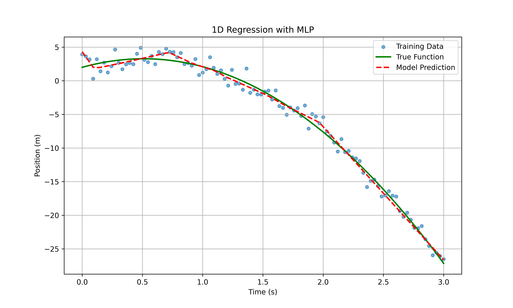
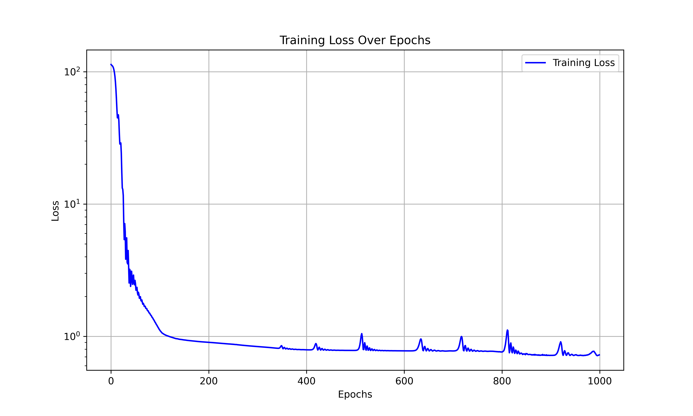

# PyTorch Tutorial

## Local Environment Setup

### 1. Install `uv`

- Follow instructions in [Installing uv](https://docs.astral.sh/uv/getting-started/installation/)

### 2. Create a virtual environment

```bash
# First, move to the directory where you want to create the virtual environment
uv venv
```

### 3. Activate the virtual environment

```bash
source .venv/bin/activate
```

### 4. Install dependencies

```bash
# Install python 3.13
uv python install 3.13

# Install dependencies
uv pip install numpy torch matplotlib scienceplots torchinfo
```

## Colab

### Open Colab

- Open [Google Colab](https://colab.research.google.com/)

---

## Results

### `02_regression.py`




